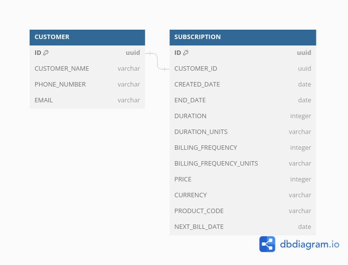

# Invoicing App

This is a sample poc code for invoicing app.

## Steps to run

- To start the app, do docker-compose up -d
- Use the postman collection for sample requests
- The server starts at the below url once all containers start

```sh
localhost:8000
```

## Database Schema

[](https://github.com/eshanchawla1592/movido-invocingapp/blob/main/db-schema.png)
